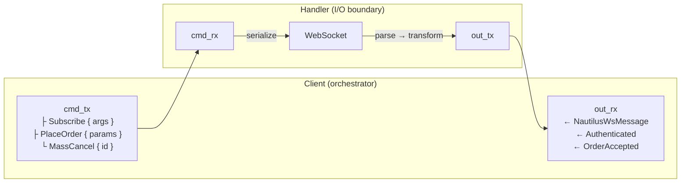

# Adapters

## Introduction

This developer guide provides specifications and instructions on how to develop an integration adapter for the NautilusTrader platform.
Adapters provide connectivity to trading venues and data providers—translating raw venue APIs into Nautilus’s unified interface and normalized domain model.

## Structure of an adapter

NautilusTrader adapters follow a layered architecture pattern with:

- **Rust core** for networking clients and performance-critical operations.
- **Python layer** for integrating Rust clients into the platform's data and execution engines.

Good references for standardized patterns are currently:

- OKX
- BitMEX
- Bybit

### Rust core (`crates/adapters/your_adapter/`)

The Rust layer handles:

- **HTTP client**: Raw API communication, request signing, rate limiting.
- **WebSocket client**: Low-latency streaming connections, message parsing.
- **Parsing**: Fast conversion of venue data to Nautilus domain models.
- **Python bindings**: PyO3 exports to make Rust functionality available to Python.

Typical Rust structure:

```
crates/adapters/your_adapter/
├── src/
│   ├── common/              # Shared types and utilities
│   │   ├── consts.rs        # Venue constants / broker IDs
│   │   ├── credential.rs    # API key storage and signing helpers
│   │   ├── enums.rs         # Venue enums mirrored in REST/WS payloads
│   │   ├── models.rs        # Shared model types
│   │   ├── parse.rs         # Shared parsing helpers
│   │   ├── urls.rs          # Environment & product aware base-url resolvers
│   │   └── testing.rs       # Fixtures reused across unit tests
│   ├── data/                # Data client (Rust-native, optional)
│   │   └── mod.rs           # Data client implementation
│   ├── execution/           # Execution client (Rust-native, optional)
│   │   └── mod.rs           # Execution client implementation
│   ├── http/                # HTTP client implementation
│   │   ├── client.rs        # HTTP client with authentication
│   │   ├── error.rs         # HTTP-specific error types
│   │   ├── models.rs        # Structs for REST payloads
│   │   ├── parse.rs         # Response parsing functions
│   │   └── query.rs         # Request and query builders
│   ├── websocket/           # WebSocket implementation
│   │   ├── client.rs        # WebSocket client
│   │   ├── enums.rs         # WebSocket-specific enums
│   │   ├── error.rs         # WebSocket-specific error types
│   │   ├── handler.rs       # Message handler / feed handler
│   │   ├── messages.rs      # Structs for stream payloads
│   │   └── parse.rs         # Message parsing functions
│   ├── python/              # PyO3 Python bindings
│   │   ├── enums.rs         # Python-exposed enums
│   │   ├── http.rs          # Python HTTP client bindings
│   │   ├── urls.rs          # Python URL helpers
│   │   ├── websocket.rs     # Python WebSocket client bindings
│   │   └── mod.rs           # Module exports
│   ├── config.rs            # Configuration structures
│   ├── error.rs             # Adapter-level error types
│   ├── factories.rs         # Factory functions (optional)
│   └── lib.rs               # Library entry point
├── tests/                   # Integration tests with mock servers
│   ├── data.rs              # Data client integration tests
│   ├── execution.rs         # Execution client integration tests
│   ├── http.rs              # HTTP client integration tests
│   └── websocket.rs         # WebSocket client integration tests
└── test_data/               # Canonical venue payloads
```

### Python layer (`nautilus_trader/adapters/your_adapter`)

The Python layer provides the integration interface through these components:

1. **Instrument Provider**: Supplies instrument definitions via `InstrumentProvider`.
2. **Data Client**: Handles market data feeds and historical data requests via `LiveDataClient` and `LiveMarketDataClient`.
3. **Execution Client**: Manages order execution via `LiveExecutionClient`.
4. **Factories**: Converts venue-specific data to Nautilus domain models.
5. **Configuration**: User-facing configuration classes for client settings.

Typical Python structure:

```
nautilus_trader/adapters/your_adapter/
├── config.py     # Configuration classes
├── constants.py  # Adapter constants
├── data.py       # LiveDataClient/LiveMarketDataClient
├── execution.py  # LiveExecutionClient
├── factories.py  # Instrument factories
├── providers.py  # InstrumentProvider
└── __init__.py   # Package initialization
```

## Adapter implementation sequence

This section outlines the recommended order for implementing an adapter. The sequence follows a dependency-driven approach where each phase builds upon the previous ones.
Adapters use a Rust-first architecture—implement the Rust core before any Python layer.

### Phase 1: Rust core infrastructure

Build the low-level networking and parsing foundation.

| Step | Component                  | Description                                                                                  |
|------|----------------------------|----------------------------------------------------------------------------------------------|
| 1.1  | HTTP error types           | Define HTTP-specific error enum with retryable/non-retryable variants (`http/error.rs`).     |
| 1.2  | HTTP client                | Implement credentials, request signing, rate limiting, and retry logic.                      |
| 1.3  | HTTP API models            | Define request/response structs for REST endpoints (`http/models.rs`, `http/query.rs`).      |
| 1.4  | HTTP parsing               | Convert venue responses to Nautilus domain models (`http/parse.rs`, `common/parse.rs`).      |
| 1.5  | WebSocket error types      | Define WebSocket-specific error enum (`websocket/error.rs`).                                 |
| 1.6  | WebSocket client           | Implement connection lifecycle, authentication, heartbeat, and reconnection.                 |
| 1.7  | WebSocket messages         | Define streaming payload types (`websocket/messages.rs`).                                    |
| 1.8  | WebSocket parsing          | Convert stream messages to Nautilus domain models (`websocket/parse.rs`).                    |
| 1.9  | Python bindings            | Expose Rust functionality via PyO3 (`python/mod.rs`).                                        |

**Milestone**: Rust crate compiles, unit tests pass, HTTP/WebSocket clients can authenticate and stream/request raw data.

### Phase 2: Instrument definitions

Instruments are the foundation—both data and execution clients depend on them.

| Step | Component                  | Description                                                                                  |
|------|----------------------------|----------------------------------------------------------------------------------------------|
| 2.1  | Instrument parsing         | Parse venue instrument definitions into Nautilus types (spot, perpetual, future, option).    |
| 2.2  | Instrument provider        | Implement `InstrumentProvider` to load, filter, and cache instruments.                       |
| 2.3  | Symbol mapping             | Handle venue-specific symbol formats and Nautilus `InstrumentId` conversion.                 |

**Milestone**: `InstrumentProvider.load_all_async()` returns valid Nautilus instruments.

### Phase 3: Market data

Build data subscriptions and historical data requests.

| Step | Component                  | Description                                                                                  |
|------|----------------------------|----------------------------------------------------------------------------------------------|
| 3.1  | Public WebSocket streams   | Subscribe to order books, trades, tickers, and other public channels.                        |
| 3.2  | Historical data requests   | Fetch historical bars, trades, and order book snapshots via HTTP.                            |
| 3.3  | Data client (Python)       | Implement `LiveDataClient` or `LiveMarketDataClient` wiring Rust clients to the data engine. |

**Milestone**: Data client connects, subscribes to instruments, and emits market data to the platform.

### Phase 4: Order execution

Build order management and account state.

| Step | Component                  | Description                                                                                  |
|------|----------------------------|----------------------------------------------------------------------------------------------|
| 4.1  | Private WebSocket streams  | Subscribe to order updates, fills, positions, and account balance changes.                   |
| 4.2  | Basic order submission     | Implement market and limit orders via HTTP or WebSocket.                                     |
| 4.3  | Order modification/cancel  | Implement order amendment and cancellation.                                                  |
| 4.4  | Execution client (Python)  | Implement `LiveExecutionClient` wiring Rust clients to the execution engine.                 |
| 4.5  | Execution reconciliation   | Generate order, fill, and position status reports for startup reconciliation.                |

**Milestone**: Execution client submits orders, receives fills, and reconciles state on connect.

### Phase 5: Advanced features

Extend coverage based on venue capabilities.

| Step | Component                  | Description                                                                                  |
|------|----------------------------|----------------------------------------------------------------------------------------------|
| 5.1  | Advanced order types       | Conditional orders, stop-loss, take-profit, trailing stops, iceberg, etc.                    |
| 5.2  | Batch operations           | Batch order submission, batch cancellation, mass cancel.                                     |
| 5.3  | Venue-specific features    | Options chains, funding rates, liquidations, or other venue-specific data.                   |

### Phase 6: Configuration and factories

Wire everything together for production usage.

| Step | Component                  | Description                                                                                  |
|------|----------------------------|----------------------------------------------------------------------------------------------|
| 6.1  | Configuration classes      | Create `LiveDataClientConfig` and `LiveExecClientConfig` subclasses.                         |
| 6.2  | Factory functions          | Implement factory functions to instantiate clients from configuration.                       |
| 6.3  | Environment variables      | Support credential resolution from environment variables.                                    |

### Phase 7: Testing and documentation

Validate the integration and document usage.

| Step | Component                  | Description                                                                                  |
|------|----------------------------|----------------------------------------------------------------------------------------------|
| 7.1  | Rust unit tests            | Test parsers, signing helpers, and business logic in `#[cfg(test)]` blocks.                  |
| 7.2  | Rust integration tests     | Test HTTP/WebSocket clients against mock Axum servers in `tests/`.                           |
| 7.3  | Python integration tests   | Test data/execution clients in `tests/integration_tests/adapters/<adapter>/`.                |
| 7.4  | Example scripts            | Provide runnable examples demonstrating data subscription and order execution.               |

See the [Testing](#testing) section for detailed test organization guidelines.

---

## Rust adapter patterns

### Common code (`common/`)

Group venue constants, credential helpers, enums, and reusable parsers under `src/common`.
Adapters such as OKX keep submodules like `consts`, `credential`, `enums`, and `urls` alongside a `testing` module
for fixtures, providing a single place for cross-cutting pieces.
When an adapter has multiple environments or product categories, add a dedicated `common::urls` helper so
REST/WebSocket base URLs stay in sync with the Python layer.

### URL resolution

Define URL constants and resolution functions in `common/urls.rs`:

```rust
const VENUE_WS_URL: &str = "wss://stream.venue.com/ws";
const VENUE_TESTNET_WS_URL: &str = "wss://testnet-stream.venue.com/ws";

pub const fn get_ws_base_url(testnet: bool) -> &'static str {
    if testnet { VENUE_TESTNET_WS_URL } else { VENUE_WS_URL }
}
```

Config structs should provide override fields (`base_url_http`, `base_url_ws`, etc.) that fall back
to these defaults when unset.

### Configurations (`config.rs`)

Expose typed config structs in `src/config.rs` so Python callers toggle venue-specific behaviour
(see how OKX wires demo URLs, retries, and channel flags).
Keep defaults minimal and delegate URL selection to helpers in `common::urls`.

### Error taxonomy (`error.rs`)

Centralise HTTP/WebSocket failure handling in an adapter-specific error enum.
BitMEX, for example, separates retryable, non-retryable, and fatal variants while embedding the original transport
error—follow that shape so operational tooling can react consistently.

### Adapter-level error aggregation

For adapters with multiple client types, define a top-level error enum in `src/error.rs` that
aggregates component errors:

```rust
#[derive(Debug, thiserror::Error)]
pub enum VenueError {
    #[error("HTTP error: {0}")]
    Http(#[from] VenueHttpError),

    #[error("WebSocket error: {0}")]
    WebSocket(#[from] VenueWsError),

    #[error("Build error: {0}")]
    Build(#[from] VenueBuildError),
}
```

This enables unified error handling at the adapter boundary while preserving component-specific
error details for debugging.

### Python exports (`python/mod.rs`)

Mirror the Rust surface area through PyO3 modules by re-exporting clients, enums, and helper functions.
When new functionality lands in Rust, add it to `python/mod.rs` so the Python layer stays in sync
(the OKX adapter is a good reference).

### Python bindings (`python/`)

Expose Rust functionality to Python through PyO3.
Mark venue-specific structs that need Python access with `#[pyclass]` and implement `#[pymethods]` blocks with
`#[getter]` attributes for field access.

For async methods in the HTTP client, use `pyo3_async_runtimes::tokio::future_into_py` to convert Rust futures
into Python awaitables.
When returning lists of custom types, map each item with `Py::new(py, item)` before constructing the Python list.
Register all exported classes and enums in `python/mod.rs` using `m.add_class::<YourType>()` so they're available
to Python code.

Follow the pattern established in other adapters: prefixing Python-facing methods with `py_*` in Rust while using
`#[pyo3(name = "method_name")]` to expose them without the prefix.

When delivering instruments from WebSocket to Python, use `instrument_any_to_pyobject()` which returns PyO3 types
for caching.
For the reverse direction (Python→Rust), use `pyobject_to_instrument_any()` in `cache_instrument()` methods.
Never call `.into_py_any()` directly on `InstrumentAny` as it doesn't implement the required trait.

### Type qualification

Adapter-specific types (enums, structs) and Nautilus domain types should not be fully qualified.
Import them at the module level and use short names (e.g., `OKXContractType` instead of
`crate::common::enums::OKXContractType`, `InstrumentId` instead of `nautilus_model::identifiers::InstrumentId`).
This keeps code concise and readable.
Only fully qualify types from `anyhow` and `tokio` to avoid ambiguity with similarly-named types from other crates.

### String interning

Use `ustr::Ustr` for any non-unique strings the platform stores repeatedly (venues, symbols, instrument IDs) to
minimise allocations and comparisons.

### Instrument cache standardization

All clients that cache instruments must implement three methods with standardized names: `cache_instruments()`
(plural, bulk replace), `cache_instrument()` (singular, upsert), and `get_instrument()` (retrieve by symbol).
WebSocket clients should use the dual-tier cache architecture (outer `DashMap`, inner `AHashMap`, command channel
sync) documented under WebSocket patterns.

### Testing helpers (`common/testing.rs`)

Store shared fixtures and payload loaders in `src/common/testing.rs` for use across HTTP and WebSocket unit tests.
This keeps `#[cfg(test)]` helpers out of production modules and encourages reuse.

### Factory module (`factories.rs`)

Complex adapters may define a `factories.rs` module for converting venue data to Nautilus types.
This centralizes transformation logic that would otherwise be scattered across HTTP and WebSocket
parsers:

```rust
// factories.rs
pub fn create_instrument(
    venue_instrument: &VenueInstrument,
    ts_init: UnixNanos,
) -> anyhow::Result<InstrumentAny> {
    match venue_instrument.instrument_type {
        InstrumentType::Perpetual => parse_perpetual(venue_instrument, ts_init),
        InstrumentType::Future => parse_future(venue_instrument, ts_init),
        InstrumentType::Option => parse_option(venue_instrument, ts_init),
    }
}
```

Use this pattern when the same venue data structures are parsed in multiple places (HTTP responses,
WebSocket updates, historical data).

## HTTP client patterns

Adapters use a standardized two-layer HTTP client architecture to separate low-level API operations from high-level domain logic while enabling efficient cloning for Python bindings.

### Client structure

The architecture consists of two complementary clients:

1. **Raw client** (`MyRawHttpClient`) - Low-level API methods matching venue endpoints.
2. **Domain client** (`MyHttpClient`) - High-level methods using Nautilus domain types.

```rust
use std::sync::Arc;
use nautilus_network::http::HttpClient;

// Raw HTTP client - low-level API methods matching venue endpoints
pub struct MyRawHttpClient {
    base_url: String,
    client: HttpClient,  // Use nautilus_network::http::HttpClient, not reqwest directly
    credential: Option<Credential>,
    retry_manager: RetryManager<MyHttpError>,
    cancellation_token: CancellationToken,
}

// Domain HTTP client - wraps raw client with Arc, provides high-level API
pub struct MyHttpClient {
    pub(crate) inner: Arc<MyRawHttpClient>,
    // Additional domain-specific state (e.g., instrument cache)
    instruments: DashMap<InstrumentId, InstrumentAny>,
}
```

**Key points**:

- **Raw client** (`MyRawHttpClient`) contains low-level HTTP methods named to match venue endpoints as closely as possible (e.g., `get_instruments`, `get_balance`, `place_order`). These methods take venue-specific query objects and return venue-specific response types.
- **Domain client** (`MyHttpClient`) wraps the raw client in an `Arc` for efficient cloning (required for Python bindings). It provides high-level methods that accept Nautilus domain types (e.g., `InstrumentId`, `ClientOrderId`) and return domain objects. It may cache instruments or other venue metadata.
- Use `nautilus_network::http::HttpClient` instead of `reqwest::Client` directly - this provides rate limiting, retry logic, and consistent error handling.
- Both clients are exposed to Python, but the domain client is the primary interface for most use cases.

### Parser functions

Parser functions convert venue-specific data structures into Nautilus domain objects. These belong in `common/parse.rs` for cross-cutting conversions (instruments, trades, bars) or `http/parse.rs` for REST-specific transformations. Each parser takes venue data plus context (account IDs, timestamps, instrument references) and returns a Nautilus domain type wrapped in `Result`.

**Standard patterns:**

- Handle string-to-numeric conversions with proper error context using `.parse::<f64>()` and `anyhow::Context`.
- Check for empty strings before parsing optional fields - venues often return `""` instead of omitting fields.
- Map venue enums to Nautilus enums explicitly with `match` statements rather than implementing automatic conversions that could hide mapping errors.
- Accept instrument references when precision or other metadata is required for constructing Nautilus types (quantities, prices).
- Use descriptive function names: `parse_position_status_report`, `parse_order_status_report`, `parse_trade_tick`.

Place parsing helpers (`parse_price_with_precision`, `parse_timestamp`) in the same module as private functions when they're reused across multiple parsers.

### Method naming and organization

The raw client contains low-level API methods that closely match venue endpoints, taking venue-specific query parameter types and returning venue response types. The domain client wraps the raw client and provides high-level methods that accept Nautilus domain types.

**Naming conventions:**

- **Raw client methods**: Named to match venue endpoints as closely as possible (e.g., `get_instruments`, `get_balance`, `place_order`). These methods are internal to the raw client and take venue-specific types (builders, JSON values).
- **Domain client methods**: Named based on operation semantics (e.g., `request_instruments`, `submit_order`, `cancel_order`). These are the methods exposed to Python and take Nautilus domain objects (InstrumentId, ClientOrderId, OrderSide, etc.).

**Domain method flow:**

Domain methods follow a three-step pattern: build venue-specific parameters from Nautilus types, call the corresponding raw client method, then parse the response. For endpoints returning domain objects (positions, orders, trades), call parser functions from `common/parse`. For endpoints returning raw venue data (fee rates, balances), extract the result directly from the response envelope. Methods prefixed with `request_*` indicate they return domain data, while methods like `submit_*`, `cancel_*`, or `modify_*` perform actions and return acknowledgments.

The domain client wraps the raw client in an `Arc` for efficient cloning required by Python bindings.

### Query parameter builders

Use the `derive_builder` crate with proper defaults and ergonomic Option handling:

```rust
use derive_builder::Builder;

#[derive(Clone, Debug, Deserialize, Serialize, Builder)]
#[serde(rename_all = "camelCase")]
#[builder(setter(into, strip_option), default)]
pub struct InstrumentsInfoParams {
    pub category: ProductType,
    #[serde(skip_serializing_if = "Option::is_none")]
    pub symbol: Option<String>,
    #[serde(skip_serializing_if = "Option::is_none")]
    pub limit: Option<u32>,
}

impl Default for InstrumentsInfoParams {
    fn default() -> Self {
        Self {
            category: ProductType::Linear,
            symbol: None,
            limit: None,
        }
    }
}
```

**Key attributes:**

- `#[builder(setter(into, strip_option), default)]` - enables clean API: `.symbol("BTCUSDT")` instead of `.symbol(Some("BTCUSDT".to_string()))`.
- `#[serde(skip_serializing_if = "Option::is_none")]` - omits optional fields from query strings.
- Always implement `Default` for builder parameters.

### Request signing and authentication

Keep signing logic in a `Credential` struct under `common/credential.rs`:

- Store API keys using `Ustr` for efficient comparison, secrets in `Box<[u8]>` with `#[zeroize]`.
- Implement `sign()` and `sign_bytes()` methods that compute HMAC-SHA256 signatures.
- Pass the credential to the raw HTTP client; the domain client delegates signing through the inner client.

For WebSocket authentication, the handler constructs login messages using the same `Credential::sign()` method with a WebSocket-specific timestamp format.

### Environment variable conventions

Adapters support loading API credentials from environment variables when not provided directly. This enables secure credential management without hardcoding secrets.

**Naming conventions:**

| Environment  | API Key Variable          | API Secret Variable |
|--------------|---------------------------|---------------------|
| Mainnet/Live | `{VENUE}_API_KEY`         | `{VENUE}_API_SECRET` |
| Testnet      | `{VENUE}_TESTNET_API_KEY` | `{VENUE}_TESTNET_API_SECRET` |
| Demo         | `{VENUE}_DEMO_API_KEY`    | `{VENUE}_DEMO_API_SECRET` |

Some venues require additional credentials:

- OKX: `OKX_API_PASSPHRASE`
- Coinbase INTX: `COINBASE_INTX_API_PASSPHRASE`, `COINBASE_INTX_PORTFOLIO_ID`

**Implementation pattern:**

Use `nautilus_core::env::get_or_env_var_opt` for optional credential resolution (returns `None` if missing) or `get_or_env_var` when credentials are required (returns error if missing):

```rust
use nautilus_core::env::get_or_env_var_opt;

let (api_key_env, api_secret_env) = if testnet {
    ("{VENUE}_TESTNET_API_KEY", "{VENUE}_TESTNET_API_SECRET")
} else {
    ("{VENUE}_API_KEY", "{VENUE}_API_SECRET")
};

let key = get_or_env_var_opt(api_key, api_key_env);
let secret = get_or_env_var_opt(api_secret, api_secret_env);
```

**Key principles:**

- Environment variable resolution should happen in core Rust code, not Python bindings.
- Use `get_or_env_var_opt` for optional credentials (public-only clients).
- Use `get_or_env_var` when credentials are required (returns error if missing).
- Document supported environment variables in adapter README files.

**Credential resolver helper:**

Encapsulate environment-based credential resolution in a helper function when the logic involves
multiple environments or fallback behavior:

```rust
use nautilus_core::env::get_or_env_var_opt;

fn resolve_credential(
    api_key: Option<&str>,
    api_secret: Option<&str>,
    is_testnet: bool,
) -> Option<Credential> {
    let (key_env, secret_env) = if is_testnet {
        ("{VENUE}_TESTNET_API_KEY", "{VENUE}_TESTNET_API_SECRET")
    } else {
        ("{VENUE}_API_KEY", "{VENUE}_API_SECRET")
    };

    let key = get_or_env_var_opt(api_key, key_env)?;
    let secret = get_or_env_var_opt(api_secret, secret_env)?;

    Some(Credential::new(key, secret))
}
```

This pattern returns `None` when credentials are unavailable, suitable for optional authentication.
For clients that require credentials, use `get_or_env_var` which returns an error if missing.

### Error handling and retry logic

Use the `RetryManager` from `nautilus_network` for consistent retry behavior.

### Rate limiting

Configure rate limiting through `HttpClient` using `LazyLock<Quota>` static variables.

**Naming conventions:**

- REST quotas: `{VENUE}_REST_QUOTA` (e.g., `OKX_REST_QUOTA`, `BYBIT_REST_QUOTA`)
- WebSocket quotas: `{VENUE}_WS_{OPERATION}_QUOTA` (e.g., `OKX_WS_CONNECTION_QUOTA`, `OKX_WS_ORDER_QUOTA`)
- Rate limit keys: `{VENUE}_RATE_LIMIT_KEY_{OPERATION}` (e.g., `OKX_RATE_LIMIT_KEY_SUBSCRIPTION`, `OKX_RATE_LIMIT_KEY_ORDER`)

**Standard rate limit keys for WebSocket:**

| Key                             | Operations                       |
|---------------------------------|----------------------------------|
| `*_RATE_LIMIT_KEY_SUBSCRIPTION` | Subscribe, unsubscribe, login.   |
| `*_RATE_LIMIT_KEY_ORDER`        | Place orders (regular and algo). |
| `*_RATE_LIMIT_KEY_CANCEL`       | Cancel orders, mass cancel.      |
| `*_RATE_LIMIT_KEY_AMEND`        | Amend/modify orders.             |

**Example:**

```rust
pub static OKX_REST_QUOTA: LazyLock<Quota> =
    LazyLock::new(|| Quota::per_second(NonZeroU32::new(250).unwrap()));

pub static OKX_WS_SUBSCRIPTION_QUOTA: LazyLock<Quota> =
    LazyLock::new(|| Quota::per_hour(NonZeroU32::new(480).unwrap()));

pub const OKX_RATE_LIMIT_KEY_ORDER: &str = "order";
```

Pass rate limit keys when sending WebSocket messages to enforce per-operation quotas:

```rust
self.send_with_retry(payload, Some(vec![OKX_RATE_LIMIT_KEY_ORDER.to_string()])).await
```

## WebSocket client patterns

WebSocket clients handle real-time streaming data and require careful management of connection state, authentication, subscriptions, and reconnection logic.

### Client structure

WebSocket adapters use a **two-layer architecture** to separate Python-accessible state from high-performance async I/O:

#### Connection state tracking

Track connection state using `Arc<ArcSwap<AtomicU8>>` to provide lock-free, race-free visibility across all clones:

```rust
use arc_swap::ArcSwap;

pub struct MyWebSocketClient {
    connection_mode: Arc<ArcSwap<AtomicU8>>,  // Shared connection mode (lock-free)
    signal: Arc<AtomicBool>,                   // Cancellation signal for graceful shutdown
    // ...
}
```

**Pattern breakdown:**

- **Outer `Arc`**: Shared across all clones (Python bindings clone clients before async operations).
- **`ArcSwap`**: Enables atomic pointer replacement via `.store()` without replacing the outer Arc.
- **Inner `Arc<AtomicU8>`**: The actual connection state from `WebSocketClient::connection_mode_atomic()`.

Initialize with a placeholder atomic (`ConnectionMode::Closed`), then in `connect()` call `.store(client.connection_mode_atomic())` to atomically swap to the underlying client's state. All clones see updates instantly through lock-free `.load()` calls in `is_active()`.

The underlying `WebSocketClient` sends a `RECONNECTED` sentinel message when reconnection completes, triggering resubscription logic in the handler.

**Outer client** (`{Venue}WebSocketClient`):

- Orchestrates connection lifecycle, authentication, subscriptions.
- Maintains state for Python access using `Arc<DashMap<K, V>>`.
- Tracks subscription state for reconnection logic.
- Stores instruments cache for replay on reconnect.
- Sends commands to handler via `cmd_tx` channel.
- Receives domain events via `out_rx` channel.

**Inner handler** (`{Venue}WsFeedHandler`):

- Runs in dedicated Tokio task as stateless I/O boundary.
- Owns `WebSocketClient` exclusively (no `RwLock` needed).
- Processes commands from `cmd_rx` → serializes to JSON → sends via WebSocket.
- Receives raw WebSocket messages → deserializes → transforms to `NautilusWsMessage` → emits via `out_tx`.
- Owns pending request state using `AHashMap<K, V>` (single-threaded, no locking).
- Owns working instruments cache for transformations.

**Communication pattern:**



**Key principles:**

- **No shared locks on hot path**: Handler owns `WebSocketClient`, client sends commands via lock-free mpsc channel.
- **Command pattern for all sends**: Subscriptions, orders, cancellations all route through `HandlerCommand` enum.
- **Event pattern for state**: Handler emits `NautilusWsMessage` events (including `Authenticated`), client maintains state from events.
- **Pending state ownership**: Handler owns `AHashMap` for matching responses (no `Arc<DashMap>` between layers).
- **Python constraint**: Client uses `Arc<DashMap>` only for state Python might query; handler uses `AHashMap` for internal matching.

### Authentication

Authentication state is managed through events:

- Handler processes `Login` response → **returns** `NautilusWsMessage::Authenticated` immediately.
- Client receives event → updates local auth state → proceeds with subscriptions.
- `AuthTracker` may be shared via `Arc` for state queries, but handler returns events directly (no blocking).

**Note**: The `Authenticated` message is consumed in the client's spawn loop for reconnection flow coordination and is not forwarded to downstream consumers (data/execution clients). Downstream consumers can query authentication state via `AuthTracker` if needed. The execution client's `Authenticated` handler only logs at debug level with no critical logic depending on this event.

### Subscription management

#### Shared `SubscriptionState` pattern

The `SubscriptionState` struct from `nautilus_network::websocket` is shared between client and handler using `Arc<DashMap<>>` internally for thread-safe access:

- **`SubscriptionState` is shared via `Arc`**: Both client and handler receive `.clone()` of the same instance (shallow clone of Arc pointers).
- **Responsibility split**: Client tracks user intent (`mark_subscribe`, `mark_unsubscribe`), handler tracks server confirmations (`confirm_subscribe`, `confirm_unsubscribe`, `mark_failure`).
- **Why both need it**: Single source of truth with lock-free concurrent access, no synchronization overhead.

#### Subscription lifecycle

A **subscription** represents any topic in one of two states:

| State         | Description |
|---------------|-------------|
| **Pending**   | Subscription request sent to venue, awaiting acknowledgment. |
| **Confirmed** | Venue acknowledged subscription and is actively streaming data. |

State transitions follow this lifecycle:

| Trigger           | Method Called        | From State | To State  | Notes |
|-------------------|----------------------|------------|-----------|-------|
| User subscribes   | `mark_subscribe()`   | —          | Pending   | Topic added to pending set. |
| Venue confirms    | `confirm()`          | Pending    | Confirmed | Moved from pending to confirmed. |
| Venue rejects     | `mark_failure()`     | Pending    | Pending   | Stays pending for retry on reconnect. |
| User unsubscribes | `mark_unsubscribe()` | Confirmed  | Pending   | Temporarily pending until ack. |
| Unsubscribe ack   | `clear_pending()`    | Pending    | Removed   | Topic fully removed. |

**Key principles**:

- `subscription_count()` reports **only confirmed subscriptions**, not pending ones.
- Failed subscriptions remain pending and are automatically retried on reconnect.
- Both confirmed and pending subscriptions are restored after reconnection.
- Unsubscribe operations must check the `op` field in acknowledgments to avoid re-confirming topics.

#### Topic format patterns

Adapters use venue-specific delimiters to structure subscription topics:

| Adapter    | Delimiter | Example                | Pattern                      |
|------------|-----------|------------------------|------------------------------|
| **BitMEX** | `:`       | `trade:XBTUSD`         | `{channel}:{symbol}`         |
| **OKX**    | `:`       | `trades:BTC-USDT-SWAP` | `{channel}:{symbol}`         |
| **Bybit**  | `.`       | `orderbook.50.BTCUSDT` | `{channel}.{depth}.{symbol}` |

Parse topics using `split_once()` with the appropriate delimiter to extract channel and symbol components.

### Reconnection logic

On reconnection, restore authentication and subscriptions:

1. **Track subscriptions**: Preserve original subscription arguments in collections (e.g., `Arc<DashMap>`) to avoid parsing topics back to arguments.

2. **Reconnection flow**:
   - Receive `NautilusWsMessage::Reconnected` from handler.
   - If authenticated: Re-authenticate and wait for confirmation.
   - Restore all tracked subscriptions via handler commands.

**Preserving subscription arguments:**

Store original subscription arguments in a separate collection to enable deterministic reconnection
replay without parsing topics back into arguments:

```rust
pub struct MyWebSocketClient {
    subscription_state: Arc<SubscriptionState>,
    subscription_args: Arc<DashMap<String, SubscriptionArgs>>,  // topic → original args
    // ...
}

impl MyWebSocketClient {
    async fn subscribe(&self, args: SubscriptionArgs) -> Result<(), Error> {
        let topic = args.to_topic();
        self.subscription_state.mark_subscribe(&topic);
        self.subscription_args.insert(topic.clone(), args.clone());
        self.send_cmd(HandlerCommand::Subscribe(args)).await
    }

    async fn unsubscribe(&self, topic: &str) -> Result<(), Error> {
        self.subscription_state.mark_unsubscribe(topic);
        self.subscription_args.remove(topic);
        self.send_cmd(HandlerCommand::Unsubscribe(topic.to_string())).await
    }

    async fn restore_subscriptions(&self) {
        for entry in self.subscription_args.iter() {
            let _ = self.send_cmd(HandlerCommand::Subscribe(entry.value().clone())).await;
        }
    }
}
```

This avoids complex topic parsing and ensures subscriptions are replayed exactly as originally
requested.

### Ping/Pong handling

Support both WebSocket control frame pings and application-level text pings:

- **Control frame pings**: Handled automatically by `WebSocketClient` via the `PingHandler` callback.
- **Text pings**: Some venues (e.g., OKX) use `"ping"`/`"pong"` text messages. Configure `heartbeat_msg: Some(TEXT_PING.to_string())` in `WebSocketConfig` and respond to incoming `TEXT_PING` with `TEXT_PONG` in the handler.

The handler should check for ping messages early in the message processing loop and respond immediately to maintain connection health.

### Instrument cache architecture

WebSocket clients that cache instruments use a **dual-tier pattern** for performance:

- **Outer client**: `Arc<DashMap<Ustr, InstrumentAny>>` provides thread-safe cache for concurrent Python access.
- **Inner handler**: `AHashMap<Ustr, InstrumentAny>` provides local cache for single-threaded hot path during message parsing.
- **Command channel**: `tokio::sync::mpsc::unbounded_channel` synchronizes updates from outer to inner.

**Command enum pattern:**

- `HandlerCommand::InitializeInstruments(Vec<InstrumentAny>)` replays cache on connect.
- `HandlerCommand::UpdateInstrument(InstrumentAny)` syncs individual updates post-connection.

**Critical implementation detail:** When `cache_instrument()` is called after connection, it must send an `UpdateInstrument` command to the inner handler. Otherwise, instruments added dynamically (e.g., from WebSocket updates) won't be available for parsing market data.

### Handler configuration constants

Define handler-specific tuning constants for consistent behavior:

| Constant                   | Purpose                                          | Typical value |
|----------------------------|--------------------------------------------------|---------------|
| `DEFAULT_HEARTBEAT_SECS`   | Interval for sending keep-alive messages.        | 15-30         |
| `WEBSOCKET_AUTH_WINDOW_MS` | Maximum age for authentication timestamps.       | 5000-30000    |
| `BATCH_PROCESSING_LIMIT`   | Maximum messages processed per event loop cycle. | 100-1000      |

Place these in `websocket/handler.rs` or `common/consts.rs` depending on scope.

### Message routing

Define two message enums for the transformation pipeline:

1. **`{Venue}WsMessage`**: Venue-specific message variants parsed directly from WebSocket JSON (login responses, subscriptions, channel data). Use `#[serde(untagged)]` or explicit tags based on venue format.

2. **`NautilusWsMessage`**: Normalized domain messages emitted to the client (data, deltas, order events, errors, `Reconnected`, `Authenticated`). Include a `Raw(serde_json::Value)` variant for unhandled channels during development.

The handler parses incoming JSON into `{Venue}WsMessage`, transforms to `NautilusWsMessage`, and sends via `out_tx`. The client receives from `out_rx` and routes to data/execution callbacks.

#### Message type naming convention

Types prefixed with `Nautilus` contain only Nautilus domain types (normalized data ready for the trading system). Types prefixed with the venue name (e.g., `Binance`, `Deribit`) contain raw exchange-specific types that require further processing.

**Top-level output enum:**

```rust
pub enum NautilusWsMessage {
    Data(NautilusDataWsMessage),          // Normalized market data
    Exec(NautilusExecWsMessage),          // Normalized execution events
    Error(BinanceWsErrorMsg),
    Reconnected,
}
```

**Pattern for multi-stage processing:**

When execution messages require additional context lookup (e.g., correlating order updates with pending order maps), use a `Raw` variant:

1. The data handler emits `NautilusWsMessage::ExecRaw(raw_msg)` for raw execution messages.
2. The execution handler receives `ExecRaw`, performs context lookup, and produces `NautilusExecWsMessage`.
3. The outer client routes normalized `NautilusExecWsMessage` events to callbacks.

This separation ensures:

- `NautilusExecWsMessage` only contains fully-resolved Nautilus domain types.
- Raw venue messages flow through internal channels without polluting the normalized output.
- Each handler has a single responsibility (parsing vs context resolution).

### Error handling

#### Client-side error propagation

Channel send failures (client → handler) should propagate loudly as `Result<(), Error>`:

```rust
impl MyWebSocketClient {
    async fn send_cmd(&self, cmd: HandlerCommand) -> Result<(), Error> {
        self.cmd_tx.read().await.send(cmd)
            .map_err(|e| Error::ClientError(format!("Handler not available: {e}")))
    }

    pub async fn submit_order(...) -> Result<(), Error> {
        let cmd = HandlerCommand::PlaceOrder { ... };
        self.send_cmd(cmd).await  // Propagates channel failures
    }
}
```

#### Handler-side retry logic

WebSocket send failures (handler → network) should be retried by the handler using `RetryManager`:

```rust
pub struct FeedHandler {
    inner: Option<WebSocketClient>,
    retry_manager: RetryManager<MyWsError>,
    // ...
}

impl FeedHandler {
    async fn send_with_retry(&self, payload: String, rate_limit_keys: Option<Vec<String>>) -> Result<(), MyWsError> {
        if let Some(client) = &self.inner {
            self.retry_manager.execute_with_retry(
                "websocket_send",
                || async {
                    client.send_text(payload.clone(), rate_limit_keys.clone())
                        .await
                        .map_err(|e| MyWsError::ClientError(format!("Send failed: {e}")))
                },
                should_retry_error,
                create_timeout_error,
            ).await
        } else {
            Err(MyWsError::ClientError("No active WebSocket client".to_string()))
        }
    }

    async fn handle_place_order(...) -> anyhow::Result<()> {
        let payload = serde_json::to_string(&request)?;

        match self.send_with_retry(payload, Some(vec![RATE_LIMIT_KEY])).await {
            Ok(()) => Ok(()),
            Err(e) => {
                // Emit OrderRejected event after retries exhausted
                let rejected = OrderRejected::new(...);
                let _ = self.out_tx.send(NautilusWsMessage::OrderRejected(rejected));
                Err(anyhow::anyhow!("Failed to send order: {e}"))
            }
        }
    }
}

fn should_retry_error(error: &MyWsError) -> bool {
    match error {
        MyWsError::NetworkError(_) | MyWsError::Timeout(_) => true,
        MyWsError::AuthenticationError(_) | MyWsError::ParseError(_) => false,
    }
}
```

**Key principles:**

- Client propagates channel failures immediately (handler unavailable).
- Handler retries transient WebSocket failures (network issues, timeouts).
- Emit error events (`OrderRejected`, `OrderCancelRejected`) when retries exhausted.
- Use `RetryManager` from `nautilus_network::retry` for consistent backoff.

### Naming conventions

Adapters follow standardized naming conventions for consistency across all venue integrations.

#### Channel naming: `raw` → `msg` → `out`

WebSocket message channels follow a three-stage transformation pipeline:

| Stage | Type | Description | Example |
|-------|------|-------------|---------|
| `raw` | Raw WebSocket frames | Bytes/text from the network layer. | `raw_rx: UnboundedReceiver<Message>` |
| `msg` | Venue-specific messages | Parsed venue message types. | `msg_rx: UnboundedReceiver<BybitWsMessage>` |
| `out` | Nautilus domain messages | Normalized platform messages. | `out_tx: UnboundedSender<NautilusWsMessage>` |

**Example flow:**

```rust
// Client creates venue message and output channels
let (msg_tx, msg_rx) = tokio::sync::mpsc::unbounded_channel();  // Venue messages (BybitWsMessage)
let (out_tx, out_rx) = tokio::sync::mpsc::unbounded_channel();  // Nautilus messages (NautilusWsMessage)

// Handler receives venue messages, outputs Nautilus messages
let handler = FeedHandler::new(
    cmd_rx,
    msg_rx,  // Input: BybitWsMessage
    out_tx,  // Output: NautilusWsMessage
    // ...
);
```

Channel names reflect the data transformation stage, not the destination. Use `raw_*` only for raw WebSocket frames (`Message`), `msg_*` for venue-specific message types, and `out_*` for Nautilus domain messages.

### Backpressure strategy

WebSocket channels on latency-critical paths are intentionally **unbounded**. The platform is latency-first and prefers an explicit crash (OOM) over delaying or dropping data under pressure.

:::note
Do not add bounded channels, buffering limits, or backpressure unless the latency requirement changes.
:::

#### Field naming: `inner` and command channels

Structs holding references to lower-level components follow these conventions:

| Field         | Type                                                | Description |
|---------------|-----------------------------------------------------|-------------|
| `inner`       | `Option<WebSocketClient>`                           | Network-level WebSocket client (handler only, exclusively owned). |
| `cmd_tx`      | `Arc<tokio::sync::RwLock<UnboundedSender<...>>>`   | Command channel to handler (client side). |
| `cmd_rx`      | `UnboundedReceiver<HandlerCommand>`                 | Command channel from client (handler side). |
| `out_tx`      | `UnboundedSender<NautilusWsMessage>`                | Output channel to client (handler side). |
| `out_rx`      | `Option<Arc<UnboundedReceiver<NautilusWsMessage>>>` | Output channel from handler (client side). |
| `task_handle` | `Option<Arc<JoinHandle<()>>>`                       | Handler task handle. |

**Example:**

```rust
// Client struct
pub struct OKXWebSocketClient {
    cmd_tx: Arc<tokio::sync::RwLock<UnboundedSender<HandlerCommand>>>,
    out_rx: Option<Arc<UnboundedReceiver<NautilusWsMessage>>>,
    task_handle: Option<Arc<JoinHandle<()>>>,
    connection_mode: Arc<ArcSwap<AtomicU8>>,  // Lock-free connection state
    // ...
}

impl OKXWebSocketClient {
    async fn send_cmd(&self, cmd: HandlerCommand) -> Result<(), Error> {
        self.cmd_tx.read().await.send(cmd)
            .map_err(|e| Error::ClientError(format!("Handler not available: {e}")))
    }
}

// Handler struct
pub struct FeedHandler {
    inner: Option<WebSocketClient>,  // Exclusively owned - no RwLock
    cmd_rx: UnboundedReceiver<HandlerCommand>,
    raw_rx: UnboundedReceiver<Message>,
    out_tx: UnboundedSender<NautilusWsMessage>,
    pending_requests: AHashMap<String, RequestData>,  // Single-threaded - no locks
    // ...
}
```

The handler exclusively owns `WebSocketClient` without locks. The client sends commands via `cmd_tx` (wrapped in `RwLock` to allow reconnection channel replacement) and receives events via `out_rx`. Use a `send_cmd()` helper to standardize command sending.

#### Type naming: `{Venue}Ws{TypeSuffix}`

All WebSocket-related types follow a standardized naming pattern: `{Venue}Ws{TypeSuffix}`

- `{Venue}`: Capitalized venue name (e.g., `OKX`, `Bybit`, `Bitmex`, `Hyperliquid`).
- `Ws`: Abbreviated "WebSocket" (not fully spelled out).
- `{TypeSuffix}`: Full type descriptor (e.g., `Message`, `Error`, `Request`, `Response`).

**Examples:**

```rust
// Correct - abbreviated Ws, full type suffix
pub enum OKXWsMessage { ... }
pub enum BybitWsError { ... }
pub struct HyperliquidWsRequest { ... }
```

**Standard type suffixes:**

- `Message`: WebSocket message enums.
- `Error`: WebSocket error types.
- `Request`: Request message types.
- `Response`: Response message types.

**Tokio channel qualification:**

Always fully qualify tokio channel types as `tokio::sync::mpsc::` to avoid ambiguity with similarly-named types from other crates. Never import `mpsc` directly at module level.

```rust
// Correct
let (tx, rx) = tokio::sync::mpsc::unbounded_channel::<MyMessage>();
```

## Modeling venue payloads

Use the following conventions when mirroring upstream schemas in Rust.

### REST models (`http::models` and `http::query`)

- Put request and response representations in `src/http/models.rs` and derive `serde::Deserialize` (add `serde::Serialize` when the adapter sends data back).
- Mirror upstream payload names with blanket casing attributes such as `#[serde(rename_all = "camelCase")]` or `#[serde(rename_all = "snake_case")]`; only add per-field renames when the upstream key would be an invalid Rust identifier or collide with a keyword (for example `#[serde(rename = "type")] pub order_type: String`).
- Keep helper structs for query parameters in `src/http/query.rs`, deriving `serde::Serialize` to remain type-safe and reusing constants from `common::consts` instead of duplicating literals.

### WebSocket messages (`websocket::messages`)

- Define streaming payload types in `src/websocket/messages.rs`, giving each venue topic a struct or enum that mirrors the upstream JSON.
- Apply the same naming guidance as REST models: rely on blanket casing renames and keep field names aligned with the venue unless syntax forces a change; consider serde helpers such as `#[serde(tag = "op")]` or `#[serde(flatten)]` and document the choice.
- Note any intentional deviations from the upstream schema in code comments and module docs so other contributors can follow the mapping quickly.

---

## Testing

Adapters should ship two layers of coverage: the Rust crate that talks to the venue and the Python glue that exposes it to the wider platform.
Keep the suites deterministic and colocated with the production code they protect.

**Key principle:** The `tests/` directory is reserved for integration tests that require external infrastructure (mock Axum servers, simulated network conditions).
Unit tests for parsing, serialization, and business logic belong in `#[cfg(test)]` blocks within source modules.

### Rust testing

#### Layout

```
crates/adapters/your_adapter/
├── src/
│   ├── http/
│   │   ├── client.rs                  # HTTP client + unit tests
│   │   └── parse.rs                   # REST payload parsers + unit tests
│   └── websocket/
│       ├── client.rs                  # WebSocket client + unit tests
│       └── parse.rs                   # Streaming parsers + unit tests
├── tests/                             # Integration tests (mock servers)
│   ├── data.rs                        # Data client integration tests
│   ├── execution.rs                   # Execution client integration tests
│   ├── http.rs                        # HTTP client integration tests
│   └── websocket.rs                   # WebSocket client integration tests
└── test_data/                         # Canonical venue payloads used by the suites
    ├── http_{method}_{endpoint}.json  # Full venue responses with retCode/result/time
    └── ws_{message_type}.json         # WebSocket message samples
```

#### Test file organization

| File                 | Purpose                                                                                                                   |
|----------------------|---------------------------------------------------------------------------------------------------------------------------|
| `tests/data.rs`      | Integration tests for the data client—validates data subscriptions, historical data requests, and market data parsing.    |
| `tests/execution.rs` | Integration tests for the execution client—validates order submission, modification, cancellation, and execution reports. |
| `tests/http.rs`      | Low-level HTTP client tests—validates request signing, error handling, and response parsing against mock Axum servers.    |
| `tests/websocket.rs` | WebSocket client tests—validates connection lifecycle, authentication, subscriptions, and message routing.                |

**Guidelines:**

- Place unit tests next to the module they exercise (`#[cfg(test)]` blocks). Use `src/common/testing.rs` (or an equivalent helper module) for shared fixtures so production files stay tidy.
- Keep Axum-based integration suites under `crates/adapters/<adapter>/tests/`, mirroring the public APIs (HTTP client, WebSocket client, data client, execution client).
- Data and execution client tests (`data.rs`, `execution.rs`) should focus on higher-level behavior: subscription workflows, order lifecycle, and domain model transformations. HTTP and WebSocket tests (`http.rs`, `websocket.rs`) focus on transport-level concerns.
- Store upstream payload samples (snapshots, REST replies) under `test_data/` and reference them from both unit and integration tests. Name test data files consistently: `http_get_{endpoint_name}.json` for REST responses, `ws_{message_type}.json` for WebSocket messages. Include complete venue response envelopes (status codes, timestamps, result wrappers) rather than just the data payload. Provide multiple realistic examples in each file - for instance, position data should include long, short, and flat positions to exercise all parser branches.
- **Test data sourcing**: Test data must be obtained from either official API documentation examples or directly from the live API via network calls. Never fabricate or generate test data manually, as this risks missing edge cases (e.g., negative precision values, scientific notation, unexpected field types) that only appear in real venue responses.

#### Unit tests

Unit tests belong in `#[cfg(test)]` blocks within source modules, not in the `tests/` directory.

**What to test (in source modules):**

- Deserialization of venue JSON payloads into Rust structs.
- Parsing functions that convert venue types to Nautilus domain models.
- Request signing and authentication helpers.
- Enum conversions and mapping logic.
- Price, quantity, and precision calculations.

**What NOT to test:**

- Standard library behavior (Vec operations, HashMap lookups, string parsing).
- Third-party crate functionality (chrono date arithmetic, serde attributes).
- Test helper code itself (fixture loaders, mock builders).

Tests should exercise production code paths. If a test only verifies that `Vec::extend()` works or that chrono can parse a date string, it provides no value.

#### Integration tests

Integration tests belong in the `tests/` directory and exercise the public API against mock infrastructure.

**What to test (in tests/ directory):**

- HTTP client requests against mock Axum servers.
- WebSocket connection lifecycle, authentication, and message routing.
- Data client subscription workflows and historical data requests.
- Execution client order submission, modification, and cancellation flows.
- Error handling and retry behavior with simulated failures.

At a minimum, review existing adapter test suites for reference patterns and ensure every adapter proves the same core behaviours.

##### HTTP client integration coverage

- **Happy paths** – fetch a representative public resource (e.g., instruments or mark price) and ensure the
  response is converted into Nautilus domain models.
- **Credential guard** – call a private endpoint without credentials and assert a structured error; repeat with
  credentials to prove success.
- **Rate limiting / retry mapping** – surface venue-specific rate-limit responses and assert the adapter produces
  the correct `OkxError`/`BitmexHttpError` variant so the retry policy can react.
- **Query builders** – exercise builders for paginated/time-bounded endpoints (historical trades, candles) and
  assert the emitted query string matches the venue specification (`after`, `before`, `limit`, etc.).
- **Error translation** – verify non-2xx upstream responses map to adapter error enums with the original code/message attached.

##### WebSocket client integration coverage

- **Login handshake** – confirm a successful login flips the internal auth state and test failure cases where the
  server returns a non-zero code; the client should surface an error and avoid marking itself as authenticated.
- **Ping/Pong** – prove both text-based and control-frame pings trigger immediate pong responses.
- **Subscription lifecycle** – assert subscription requests/acks are emitted for public and private channels, and that
  unsubscribe calls remove entries from the cached subscription sets.
- **Reconnect behaviour** – simulate a disconnect and ensure the client re-authenticates, restores public channels,
  and skips private channels that were explicitly unsubscribed pre-disconnect.
- **Message routing** – feed representative data/ack/error payloads through the socket and assert they arrive on the
  public stream as the correct `NautilusWsMessage` variant.
- **Quota tagging** – (optional but recommended) validate that order/cancel/amend operations are tagged with the
  appropriate quota label so rate limiting can be enforced independently of subscription traffic.

**CI robustness:**

- Never use bare `tokio::time::sleep()` with arbitrary durations—tests become flaky under CI load and slower than necessary.
- Use the `wait_until_async` test helper to poll for conditions with timeout. This makes tests both faster (returns immediately when condition is met) and more robust (explicit timeout instead of hoping a sleep duration is long enough).
- Prefer event-driven assertions with shared state (for example, collect `subscription_events`, track pending/confirmed topics, wait for `connection_count` transitions).
- Use adapter-specific helpers to gate on explicit signals such as "auth confirmed" or "reconnection finished" so suites remain deterministic under load.

### Python testing

#### Layout

```
tests/integration_tests/adapters/your_adapter/
├── conftest.py           # Shared fixtures (mock clients, test instruments)
├── test_data.py          # Data client integration tests
├── test_execution.py     # Execution client integration tests
├── test_providers.py     # Instrument provider tests
├── test_factories.py     # Factory and configuration tests
└── __init__.py           # Package initialization
```

#### Test file organization

| File                | Purpose                                                                                                            |
|---------------------|--------------------------------------------------------------------------------------------------------------------|
| `test_data.py`      | Tests for `LiveDataClient` and `LiveMarketDataClient`—validates subscriptions, data parsing, and message handling. |
| `test_execution.py` | Tests for `LiveExecutionClient`—validates order submission, modification, cancellation, and execution reports.     |
| `test_providers.py` | Tests for `InstrumentProvider`—validates instrument loading, filtering, and caching behavior.                      |
| `test_factories.py` | Tests for factory functions—validates client instantiation and configuration wiring.                               |

**Guidelines:**

- Exercise the adapter's Python surface (instrument providers, data/execution clients, factories) inside `tests/integration_tests/adapters/<adapter>/`.
- Mock the PyO3 boundary (`nautilus_pyo3` shims, stubbed Rust clients) so tests stay fast while verifying that configuration, factory wiring, and error handling match the exported Rust API.
- Mirror the Rust integration coverage: when the Rust suite adds a new behaviour (e.g., reconnection replay, error propagation), assert the Python layer performs the same sequence (connect/disconnect, submit/amend/cancel translations, venue ID hand-off, failure handling). BitMEX's Python tests provide the target level of detail.

---

## Documentation

All adapter documentation—module-level docs, doc comments, and inline comments—should follow the [Documentation Style Guide](docs.md).
Consistent documentation helps maintainers and users understand adapter behavior without reading implementation details.

### Rust documentation requirements

Every Rust module, struct, and public method must have documentation comments.
Use third-person declarative voice (e.g., "Returns the account ID" not "Return the account ID").

- **Modules**: Use `//!` doc comments at the top of each file (after the license header) to describe the module's purpose.
- **Structs**: Use `///` doc comments above struct definitions. Keep descriptions concise—one sentence is often sufficient.
- **Public methods**: Every `pub fn` and `pub async fn` must have a `///` doc comment describing what the method does.
  Do not document individual parameters in a separate `# Arguments` section—the type signatures and names should be self-explanatory.
  Parameters may be mentioned in the description when behavior is complex or non-obvious.

**What NOT to document**:

- Private methods and fields (unless complex logic warrants it).
- Individual parameters/arguments (use descriptive names instead).
- Implementation details that are obvious from the code.
- Files in the `python/` module (PyO3 bindings)—documentation conventions are TBD (*may* use numpydoc specification).

---

## Python adapter layer

Below is a step-by-step guide to building an adapter for a new data provider using the provided template.

### InstrumentProvider

The `InstrumentProvider` supplies instrument definitions available on the venue. This
includes loading all available instruments, specific instruments by ID, and applying filters to the
instrument list.

```python
from nautilus_trader.common.providers import InstrumentProvider
from nautilus_trader.model import InstrumentId


class TemplateInstrumentProvider(InstrumentProvider):
    """Example `InstrumentProvider` showing the minimal overrides required for a complete integration."""

    async def load_all_async(self, filters: dict | None = None) -> None:
        raise NotImplementedError("implement `load_all_async` in your adapter subclass")

    async def load_ids_async(self, instrument_ids: list[InstrumentId], filters: dict | None = None) -> None:
        raise NotImplementedError("implement `load_ids_async` in your adapter subclass")

    async def load_async(self, instrument_id: InstrumentId, filters: dict | None = None) -> None:
        raise NotImplementedError("implement `load_async` in your adapter subclass")
```

| Method           | Description                                                    |
|------------------|----------------------------------------------------------------|
| `load_all_async` | Loads all instruments asynchronously, optionally with filters. |
| `load_ids_async` | Loads specific instruments by their IDs.                       |
| `load_async`     | Loads a single instrument by its ID.                           |

### DataClient

The `LiveDataClient` handles the subscription and management of data feeds that are not specifically
related to market data. This might include news feeds, custom data streams, or other data sources
that enhance trading strategies but do not directly represent market activity.

```python
from nautilus_trader.data.messages import RequestData
from nautilus_trader.data.messages import SubscribeData
from nautilus_trader.data.messages import UnsubscribeData
from nautilus_trader.live.data_client import LiveDataClient
from nautilus_trader.model import DataType


class TemplateLiveDataClient(LiveDataClient):
    """Example `LiveDataClient` showing the overridable abstract methods."""

    async def _connect(self) -> None:
        raise NotImplementedError("implement `_connect` in your adapter subclass")

    async def _disconnect(self) -> None:
        raise NotImplementedError("implement `_disconnect` in your adapter subclass")

    async def _subscribe(self, command: SubscribeData) -> None:
        raise NotImplementedError("implement `_subscribe` in your adapter subclass")

    async def _unsubscribe(self, command: UnsubscribeData) -> None:
        raise NotImplementedError("implement `_unsubscribe` in your adapter subclass")

    async def _request(self, request: RequestData) -> None:
        raise NotImplementedError("implement `_request` in your adapter subclass")
```

| Method         | Description                                    |
|----------------|------------------------------------------------|
| `_connect`     | Establishes a connection to the data provider. |
| `_disconnect`  | Closes the connection to the data provider.    |
| `_subscribe`   | Subscribes to a specific data type.            |
| `_unsubscribe` | Unsubscribes from a specific data type.        |
| `_request`     | Requests data from the provider.               |

### MarketDataClient

The `MarketDataClient` handles market-specific data such as order books, top-of-book quotes and trades,
and instrument status updates. It focuses on providing historical and real-time market data that is essential for
trading operations.

```python
from nautilus_trader.data.messages import RequestBars
from nautilus_trader.data.messages import RequestData
from nautilus_trader.data.messages import RequestInstrument
from nautilus_trader.data.messages import RequestInstruments
from nautilus_trader.data.messages import RequestOrderBookDepth
from nautilus_trader.data.messages import RequestOrderBookSnapshot
from nautilus_trader.data.messages import RequestQuoteTicks
from nautilus_trader.data.messages import RequestTradeTicks
from nautilus_trader.data.messages import SubscribeBars
from nautilus_trader.data.messages import SubscribeData
from nautilus_trader.data.messages import SubscribeFundingRates
from nautilus_trader.data.messages import SubscribeIndexPrices
from nautilus_trader.data.messages import SubscribeInstrument
from nautilus_trader.data.messages import SubscribeInstrumentClose
from nautilus_trader.data.messages import SubscribeInstruments
from nautilus_trader.data.messages import SubscribeInstrumentStatus
from nautilus_trader.data.messages import SubscribeMarkPrices
from nautilus_trader.data.messages import SubscribeOrderBook
from nautilus_trader.data.messages import SubscribeQuoteTicks
from nautilus_trader.data.messages import SubscribeTradeTicks
from nautilus_trader.data.messages import UnsubscribeBars
from nautilus_trader.data.messages import UnsubscribeData
from nautilus_trader.data.messages import UnsubscribeFundingRates
from nautilus_trader.data.messages import UnsubscribeIndexPrices
from nautilus_trader.data.messages import UnsubscribeInstrument
from nautilus_trader.data.messages import UnsubscribeInstrumentClose
from nautilus_trader.data.messages import UnsubscribeInstruments
from nautilus_trader.data.messages import UnsubscribeInstrumentStatus
from nautilus_trader.data.messages import UnsubscribeMarkPrices
from nautilus_trader.data.messages import UnsubscribeOrderBook
from nautilus_trader.data.messages import UnsubscribeQuoteTicks
from nautilus_trader.data.messages import UnsubscribeTradeTicks
from nautilus_trader.live.data_client import LiveMarketDataClient


class TemplateLiveMarketDataClient(LiveMarketDataClient):
    """Example `LiveMarketDataClient` showing the overridable abstract methods."""

    async def _connect(self) -> None:
        raise NotImplementedError("implement `_connect` in your adapter subclass")

    async def _disconnect(self) -> None:
        raise NotImplementedError("implement `_disconnect` in your adapter subclass")

    async def _subscribe(self, command: SubscribeData) -> None:
        raise NotImplementedError("implement `_subscribe` in your adapter subclass")

    async def _unsubscribe(self, command: UnsubscribeData) -> None:
        raise NotImplementedError("implement `_unsubscribe` in your adapter subclass")

    async def _request(self, request: RequestData) -> None:
        raise NotImplementedError("implement `_request` in your adapter subclass")

    async def _subscribe_instruments(self, command: SubscribeInstruments) -> None:
        raise NotImplementedError("implement `_subscribe_instruments` in your adapter subclass")

    async def _unsubscribe_instruments(self, command: UnsubscribeInstruments) -> None:
        raise NotImplementedError("implement `_unsubscribe_instruments` in your adapter subclass")

    async def _subscribe_instrument(self, command: SubscribeInstrument) -> None:
        raise NotImplementedError("implement `_subscribe_instrument` in your adapter subclass")

    async def _unsubscribe_instrument(self, command: UnsubscribeInstrument) -> None:
        raise NotImplementedError("implement `_unsubscribe_instrument` in your adapter subclass")

    async def _subscribe_order_book_deltas(self, command: SubscribeOrderBook) -> None:
        raise NotImplementedError("implement `_subscribe_order_book_deltas` in your adapter subclass")

    async def _unsubscribe_order_book_deltas(self, command: UnsubscribeOrderBook) -> None:
        raise NotImplementedError("implement `_unsubscribe_order_book_deltas` in your adapter subclass")

    async def _subscribe_order_book_depth(self, command: SubscribeOrderBook) -> None:
        raise NotImplementedError("implement `_subscribe_order_book_depth` in your adapter subclass")

    async def _unsubscribe_order_book_depth(self, command: UnsubscribeOrderBook) -> None:
        raise NotImplementedError("implement `_unsubscribe_order_book_depth` in your adapter subclass")

    async def _subscribe_quote_ticks(self, command: SubscribeQuoteTicks) -> None:
        raise NotImplementedError("implement `_subscribe_quote_ticks` in your adapter subclass")

    async def _unsubscribe_quote_ticks(self, command: UnsubscribeQuoteTicks) -> None:
        raise NotImplementedError("implement `_unsubscribe_quote_ticks` in your adapter subclass")

    async def _subscribe_trade_ticks(self, command: SubscribeTradeTicks) -> None:
        raise NotImplementedError("implement `_subscribe_trade_ticks` in your adapter subclass")

    async def _unsubscribe_trade_ticks(self, command: UnsubscribeTradeTicks) -> None:
        raise NotImplementedError("implement `_unsubscribe_trade_ticks` in your adapter subclass")

    async def _subscribe_mark_prices(self, command: SubscribeMarkPrices) -> None:
        raise NotImplementedError("implement `_subscribe_mark_prices` in your adapter subclass")

    async def _unsubscribe_mark_prices(self, command: UnsubscribeMarkPrices) -> None:
        raise NotImplementedError("implement `_unsubscribe_mark_prices` in your adapter subclass")

    async def _subscribe_index_prices(self, command: SubscribeIndexPrices) -> None:
        raise NotImplementedError("implement `_subscribe_index_prices` in your adapter subclass")

    async def _unsubscribe_index_prices(self, command: UnsubscribeIndexPrices) -> None:
        raise NotImplementedError("implement `_unsubscribe_index_prices` in your adapter subclass")

    async def _subscribe_funding_rates(self, command: SubscribeFundingRates) -> None:
        raise NotImplementedError("implement `_subscribe_funding_rates` in your adapter subclass")

    async def _unsubscribe_funding_rates(self, command: UnsubscribeFundingRates) -> None:
        raise NotImplementedError("implement `_unsubscribe_funding_rates` in your adapter subclass")

    async def _subscribe_bars(self, command: SubscribeBars) -> None:
        raise NotImplementedError("implement `_subscribe_bars` in your adapter subclass")

    async def _unsubscribe_bars(self, command: UnsubscribeBars) -> None:
        raise NotImplementedError("implement `_unsubscribe_bars` in your adapter subclass")

    async def _subscribe_instrument_status(self, command: SubscribeInstrumentStatus) -> None:
        raise NotImplementedError("implement `_subscribe_instrument_status` in your adapter subclass")

    async def _unsubscribe_instrument_status(self, command: UnsubscribeInstrumentStatus) -> None:
        raise NotImplementedError("implement `_unsubscribe_instrument_status` in your adapter subclass")

    async def _subscribe_instrument_close(self, command: SubscribeInstrumentClose) -> None:
        raise NotImplementedError("implement `_subscribe_instrument_close` in your adapter subclass")

    async def _unsubscribe_instrument_close(self, command: UnsubscribeInstrumentClose) -> None:
        raise NotImplementedError("implement `_unsubscribe_instrument_close` in your adapter subclass")

    async def _request_instrument(self, request: RequestInstrument) -> None:
        raise NotImplementedError("implement `_request_instrument` in your adapter subclass")

    async def _request_instruments(self, request: RequestInstruments) -> None:
        raise NotImplementedError("implement `_request_instruments` in your adapter subclass")

    async def _request_quote_ticks(self, request: RequestQuoteTicks) -> None:
        raise NotImplementedError("implement `_request_quote_ticks` in your adapter subclass")

    async def _request_trade_ticks(self, request: RequestTradeTicks) -> None:
        raise NotImplementedError("implement `_request_trade_ticks` in your adapter subclass")

    async def _request_bars(self, request: RequestBars) -> None:
        raise NotImplementedError("implement `_request_bars` in your adapter subclass")

    async def _request_order_book_snapshot(self, request: RequestOrderBookSnapshot) -> None:
        raise NotImplementedError("implement `_request_order_book_snapshot` in your adapter subclass")

    async def _request_order_book_depth(self, request: RequestOrderBookDepth) -> None:
        raise NotImplementedError("implement `_request_order_book_depth` in your adapter subclass")
```

| Method                             | Description                                             |
|------------------------------------|---------------------------------------------------------|
| `_connect`                         | Establishes a connection to the venue APIs.             |
| `_disconnect`                      | Closes the connection to the venue APIs.                |
| `_subscribe`                       | Subscribes to generic data (base for custom types).     |
| `_unsubscribe`                     | Unsubscribes from generic data (base for custom types). |
| `_request`                         | Requests generic data (base for custom types).          |
| `_subscribe_instruments`           | Subscribes to market data for multiple instruments.     |
| `_unsubscribe_instruments`         | Unsubscribes from market data for multiple instruments. |
| `_subscribe_instrument`            | Subscribes to market data for a single instrument.      |
| `_unsubscribe_instrument`          | Unsubscribes from market data for a single instrument.  |
| `_subscribe_order_book_deltas`     | Subscribes to order book delta updates.                 |
| `_unsubscribe_order_book_deltas`   | Unsubscribes from order book delta updates.             |
| `_subscribe_order_book_depth`      | Subscribes to order book depth updates.                 |
| `_unsubscribe_order_book_depth`    | Unsubscribes from order book depth updates.             |
| `_subscribe_quote_ticks`           | Subscribes to top-of-book quote updates.                |
| `_unsubscribe_quote_ticks`         | Unsubscribes from quote tick updates.                   |
| `_subscribe_trade_ticks`           | Subscribes to trade tick updates.                       |
| `_unsubscribe_trade_ticks`         | Unsubscribes from trade tick updates.                   |
| `_subscribe_mark_prices`           | Subscribes to mark price updates.                       |
| `_unsubscribe_mark_prices`         | Unsubscribes from mark price updates.                   |
| `_subscribe_index_prices`          | Subscribes to index price updates.                      |
| `_unsubscribe_index_prices`        | Unsubscribes from index price updates.                  |
| `_subscribe_funding_rates`         | Subscribes to funding rate updates.                     |
| `_unsubscribe_funding_rates`       | Unsubscribes from funding rate updates.                 |
| `_subscribe_bars`                  | Subscribes to bar/candlestick updates.                  |
| `_unsubscribe_bars`                | Unsubscribes from bar updates.                          |
| `_subscribe_instrument_status`     | Subscribes to instrument status updates.                |
| `_unsubscribe_instrument_status`   | Unsubscribes from instrument status updates.            |
| `_subscribe_instrument_close`      | Subscribes to instrument close price updates.           |
| `_unsubscribe_instrument_close`    | Unsubscribes from instrument close price updates.       |
| `_request_instrument`              | Requests historical data for a single instrument.       |
| `_request_instruments`             | Requests historical data for multiple instruments.      |
| `_request_quote_ticks`             | Requests historical quote tick data.                    |
| `_request_trade_ticks`             | Requests historical trade tick data.                    |
| `_request_bars`                    | Requests historical bar data.                           |
| `_request_order_book_snapshot`     | Requests an order book snapshot.                        |
| `_request_order_book_depth`        | Requests order book depth.                              |

### ExecutionClient

The `ExecutionClient` is responsible for order management, including submission, modification, and
cancellation of orders. It is a crucial component of the adapter that interacts with the venue
trading system to manage and execute trades.

```python
from nautilus_trader.execution.messages import BatchCancelOrders
from nautilus_trader.execution.messages import CancelAllOrders
from nautilus_trader.execution.messages import CancelOrder
from nautilus_trader.execution.messages import GenerateFillReports
from nautilus_trader.execution.messages import GenerateOrderStatusReport
from nautilus_trader.execution.messages import GenerateOrderStatusReports
from nautilus_trader.execution.messages import GeneratePositionStatusReports
from nautilus_trader.execution.messages import ModifyOrder
from nautilus_trader.execution.messages import SubmitOrder
from nautilus_trader.execution.messages import SubmitOrderList
from nautilus_trader.execution.reports import ExecutionMassStatus
from nautilus_trader.execution.reports import FillReport
from nautilus_trader.execution.reports import OrderStatusReport
from nautilus_trader.execution.reports import PositionStatusReport
from nautilus_trader.live.execution_client import LiveExecutionClient


class TemplateLiveExecutionClient(LiveExecutionClient):
    """Example `LiveExecutionClient` outlining the required overrides."""

    async def _connect(self) -> None:
        raise NotImplementedError("implement `_connect` in your adapter subclass")

    async def _disconnect(self) -> None:
        raise NotImplementedError("implement `_disconnect` in your adapter subclass")

    async def _submit_order(self, command: SubmitOrder) -> None:
        raise NotImplementedError("implement `_submit_order` in your adapter subclass")

    async def _submit_order_list(self, command: SubmitOrderList) -> None:
        raise NotImplementedError("implement `_submit_order_list` in your adapter subclass")

    async def _modify_order(self, command: ModifyOrder) -> None:
        raise NotImplementedError("implement `_modify_order` in your adapter subclass")

    async def _cancel_order(self, command: CancelOrder) -> None:
        raise NotImplementedError("implement `_cancel_order` in your adapter subclass")

    async def _cancel_all_orders(self, command: CancelAllOrders) -> None:
        raise NotImplementedError("implement `_cancel_all_orders` in your adapter subclass")

    async def _batch_cancel_orders(self, command: BatchCancelOrders) -> None:
        raise NotImplementedError("implement `_batch_cancel_orders` in your adapter subclass")

    async def generate_order_status_report(
        self,
        command: GenerateOrderStatusReport,
    ) -> OrderStatusReport | None:
        raise NotImplementedError("method `generate_order_status_report` must be implemented in the subclass")

    async def generate_order_status_reports(
        self,
        command: GenerateOrderStatusReports,
    ) -> list[OrderStatusReport]:
        raise NotImplementedError("method `generate_order_status_reports` must be implemented in the subclass")

    async def generate_fill_reports(
        self,
        command: GenerateFillReports,
    ) -> list[FillReport]:
        raise NotImplementedError("method `generate_fill_reports` must be implemented in the subclass")

    async def generate_position_status_reports(
        self,
        command: GeneratePositionStatusReports,
    ) -> list[PositionStatusReport]:
        raise NotImplementedError("method `generate_position_status_reports` must be implemented in the subclass")

    async def generate_mass_status(
        self,
        lookback_mins: int | None = None,
    ) -> ExecutionMassStatus | None:
        raise NotImplementedError("method `generate_mass_status` must be implemented in the subclass")
```

| Method                             | Description                                               |
|------------------------------------|-----------------------------------------------------------|
| `_connect`                         | Establishes a connection to the venue APIs.               |
| `_disconnect`                      | Closes the connection to the venue APIs.                  |
| `_submit_order`                    | Submits a new order to the venue.                         |
| `_submit_order_list`               | Submits a list of orders to the venue.                    |
| `_modify_order`                    | Modifies an existing order on the venue.                  |
| `_cancel_order`                    | Cancels a specific order on the venue.                    |
| `_cancel_all_orders`               | Cancels all orders for an instrument on the venue.        |
| `_batch_cancel_orders`             | Cancels a batch of orders for an instrument on the venue. |
| `generate_order_status_report`     | Generates a report for a specific order on the venue.     |
| `generate_order_status_reports`    | Generates reports for all orders on the venue.            |
| `generate_fill_reports`            | Generates reports for filled orders on the venue.         |
| `generate_position_status_reports` | Generates reports for position status on the venue.       |
| `generate_mass_status`             | Generates execution mass status reports.                  |

### Configuration

The configuration file defines settings specific to the adapter, such as API keys and connection
details. These settings are essential for initializing and managing the adapter’s connection to the
data provider.

```python
from nautilus_trader.config import LiveDataClientConfig
from nautilus_trader.config import LiveExecClientConfig


class TemplateDataClientConfig(LiveDataClientConfig):
    """Configuration for `TemplateDataClient` instances."""

    api_key: str
    api_secret: str
    base_url: str


class TemplateExecClientConfig(LiveExecClientConfig):
    """Configuration for `TemplateExecClient` instances."""

    api_key: str
    api_secret: str
    base_url: str
```

**Key attributes**:

- `api_key`: The API key for authenticating with the data provider.
- `api_secret`: The API secret for authenticating with the data provider.
- `base_url`: The base URL for connecting to the data provider's API.

## Common test scenarios

Exercise adapters across every venue behaviour they claim to support. Incorporate these scenarios into the Rust and Python suites.

### Product coverage

Ensure each supported product family is tested.

- Spot instruments
- Derivatives (perpetuals, futures, swaps)
- Options and structured products

### Order flow

- Cover each supported order type (limit, market, stop, conditional, etc.) under every venue time-in-force option, expiries, and rejection handling.
- Submit buy and sell market orders and assert balance, position, and average-price updates align with venue responses.
- Submit representative buy and sell limit orders, verifying acknowledgements, execution reports, full and partial fills, and cancel flows.

### State management

- Start sessions with existing open orders to ensure the adapter reconciles state on connect before issuing new commands.
- Seed preloaded positions and confirm position snapshots, valuation, and PnL agree with the venue prior to trading.
